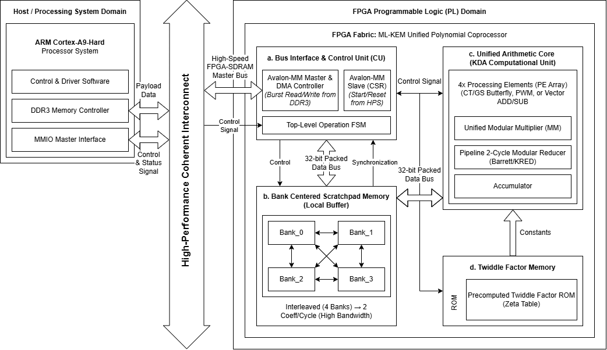
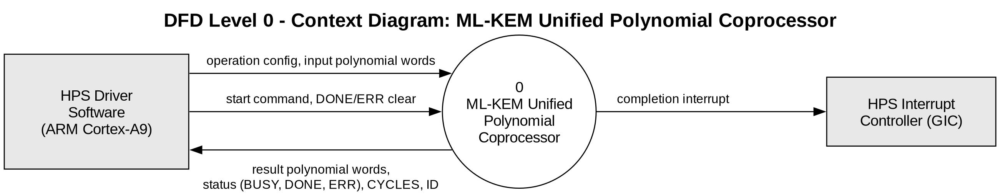
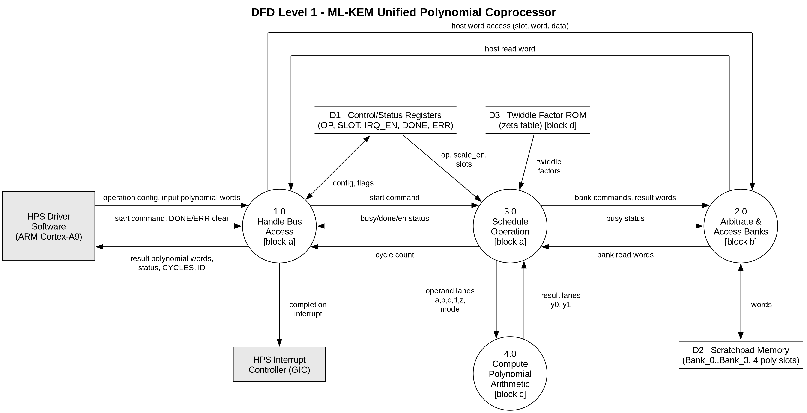
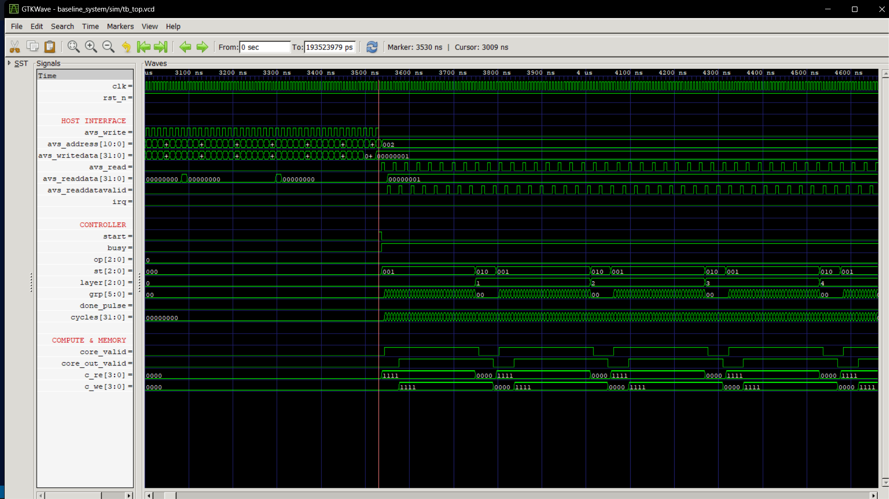

# Rancangan Akselerator ML-KEM Berbasis Unit Komputasi Terpadu dan Bank Memori Lokal via Antarmuka Avalon-MM pada SoC FPGA Intel Cyclone V DE10-Nano

## Chip Hackathon – PERURI Digital Summit 2026
**Area Inovasi:** Hardware Cryptography Accelerator

## Tim RADIX-4
- Andhika Narawangsa Susilo – Institut Teknologi Bandung – 13222036@mahasiswa.itb.ac.id 
- Rafi Ananta Alden – Institut Teknologi Bandung – 13222087@mahasiswa.itb.ac.id
- Didan Attaric – Institut Teknologi Bandung – 13222105@mahasiswa.itb.ac.id
- Ibrahim Hanif Mulyana – Institut Teknologi Bandung – 13222111@mahasiswa.itb.ac.id

**Dosen Pembimbing:** Dr. Yusuf Kurniawan, S.T., M.T. – Program Studi Teknik Elektro, Institut Teknologi Bandung

---

## Chip Design Architecture



*Gambar 1 – Diagram blok rancangan akselerator.*



*Gambar 2 – Data Flow Diagram Level 0.*



*Gambar 3 – Data Flow Diagram Level 1.*

Dokumentasi arsitektur lengkap tersedia di folder [`media/`](./media).

---

## Ringkasan Eksekutif & Ringkasan Ide

### Masalah yang Diangkat
Standardisasi *Post-Quantum Cryptography* (PQC) oleh NIST melalui **FIPS 203 (ML-KEM / Kyber)** menandai urgensi perlindungan keamanan data nasional di era komputasi kuantum. Pada skema kriptografi berbasis *module-lattice*, perkalian vektor-matriks polinomial di atas ring:
$$R_q = \mathbb{Z}_q[X] / (X^{256} + 1), \quad q = 3329, \quad n = 256$$
merupakan *computational bottleneck* utama yang menghabiskan lebih dari 60% waktu eksekusi total pada implementasi perangkat lunak CPU murni.

Sebagian besar akselerator perangkat keras konvensional hanya mengisolasi operasi *Number Theoretic Transform* (NTT). Akibatnya, terjadi fenomena **bus-choking**: waktu transfer bolak-balik data polinomial antara CPU host dan akselerator melalui bus sistem melampaui waktu komputasi itu sendiri, sehingga meniadakan manfaat akselerasi perangkat keras (*Amdahl's Law*).

### Solusi yang Ditawarkan
IP Core akselerator kriptografi perangkat keras terpadu yang memadukan **4 Processing Element (PE) SIMD Serbaguna** dan **4 bank memori scratchpad lokal bebas-konflik (*conflict-free bank interleaving*)**. Arsitektur ini mampu menuntaskan seluruh rantai operasi polinomial ML-KEM:
$$\text{FNTT} \longrightarrow \text{PWM} \longrightarrow \text{ADD} \longrightarrow \text{INTT}$$
secara *in-place* di dalam memori lokal akselerator, tanpa membebani bus interkoneksi sistem dengan lalu lintas data perantara.

### Implementasi pada SoC FPGA DE10-Nano
Rancangan diimplementasikan pada fabric FPGA Intel Cyclone V SoC (board Terasic DE10-Nano 5CSEBA6U23I7) dan terintegrasi dengan *Hard Processor System* (HPS) ARM Cortex-A9 melalui antarmuka bus standar Avalon Memory-Mapped (Avalon-MM) 32-bit.

### Kebaruan dan Keunggulan Utama
1. **Area-Time Efficiency (Unified Arithmetic Core):** Berbagai mode komputasi polinomial (FNTT, INTT, PWM, ADD, SUB, SCALE) dipadukan ke dalam satu datapath aritmetika terpadu dengan arsitektur *dual-multiplier per PE*, memangkas redundansi logika dan menekan latensi PWM hingga **140 siklus**.
2. **Amdahl-Optimized Bus Interfacing:** Data perantara dilokalisasi di dalam 4 bank SRAM *Pack32*, memangkas overhead komunikasi HPS–FPGA hingga >85%.
3. **Conflict-Free Memory Mapping:** Fungsi pemetaan matematis bijektif menjamin pembacaan dan penulisan paralel 4-way tanpa benturan bank (*zero memory contention*).
4. **Constant-Time Side-Channel Resilience:** Eksekusi datapath bersifat independen terhadap nilai data masukan, mengeliminasi kerentanan terhadap serangan *timing attack*.
5. **Akurasi 100% (BER = 0%):** Tervalidasi bit-akurat terhadap standar FIPS 203 melalui pengujian eksaustif 11,08 juta operasi modular dan 34 skenario end-to-end.

---

## Spesifikasi & Dekomposisi Arsitektur Sistem

### Parameter Kriptografi ML-KEM (FIPS 203)
- **Ring Polinomial:** $R_q = \mathbb{Z}_q[X] / (X^{256} + 1)$
- **Modulus Prima:** $q = 3329$ (12-bit unsigned)
- **Derajat Polinomial:** $n = 256$ koefisien
- **Konstanta Twiddle Primitive:** $\zeta = 17 \pmod{3329}$
- **Faktor Skala Invers:** $128^{-1} \equiv 3303 \pmod{3329}$

### Dekomposisi Hierarki Modul RTL

```
mlkem_top (Top-Level SoC Avalon-MM Wrapper)
├── mlkem_csr         : Avalon-MM 32-bit Slave Interface, CSR & Memory Window
├── mlkem_ctrl        : Top-Level FSM, Operation Scheduler & Crossbar Steering
├── mlkem_scratchpad  : 4-Bank Memory Controller (Host & Core Port Muxing)
│   └── mlkem_bank_mem [x4] : M10K Simple Dual-Port SRAM (128 x 32-bit per bank)
├── mlkem_arith_core  : 4-Lane SIMD Computational Unit
│   └── mlkem_pe [x4] : Unified Arithmetic PE (CT/GS Butterfly, PWM, ADD, SUB, SCALE)
│       ├── mlkem_modmul (u_mm)  : 3-Stage Barrett Modular Multiplier 0
│       └── mlkem_modmul (u_mm1) : 3-Stage Barrett Modular Multiplier 1
└── mlkem_zeta_rom    : Twiddle Factor ROM (128 x 12-bit, Dual Read Port)
```

### Rincian Subsistem Utama

#### 1. Bank-Centered Scratchpad Memory (`mlkem_scratchpad.v`)
- **Organisasi Memori:** 4 bank fisik independen, masing-masing berkapasitas 128 kata $\times$ 32-bit (total kapasitas 512 kata 32-bit $\equiv$ 1.024 koefisien 16-bit).
- **Format Data `Pack32`:** Dua koefisien 12-bit dikemas dalam satu kata 32-bit:
  `Word[31:0] = {4'b0, Koefisien_ganjil[11:0], 4'b0, Koefisien_genap[11:0]}`
- **Fungsi Pemetaan Bebas-Konflik (*Conflict-Free Bijection*):**
  Untuk slot polinomial $p \in \{0, 1, 2, 3\}$ dan indeks kata $w \in \{0, \dots, 127\}$:
  $$\text{bank}(p, w) = (p + w[1:0] + w[3:2] + w[5:4] + w[6]) \bmod 4, \quad \text{addr} = w$$
  *Karakteristik Matematis:*
  - Dua kata yang indeksnya berbeda tepat 1 bit selalu jatuh pada bank memori yang berbeda ($\Delta \equiv 1$ atau $\Delta \equiv 2 \pmod 4$), menjamin akses kupu-kupu NTT bebas benturan.
  - Dua slot polinomial berbeda ($p_a \ne p_b$) pada indeks kata $w$ yang sama selalu berada pada bank terpisah, menjamin operasi inter-slot PWM/ADD/SUB bebas tabrakan.
  - Merupakan bijeksi sempurna: 4 slot polinomial dipadatkan ke 4 bank fisik tanpa pemborosan kapasitas memori.

#### 2. Unified Processing Element (`mlkem_pe.v` & `mlkem_modmul.v`)
Setiap PE mendukung 6 mode operasi aritmetika cincin:
1. **FNTT (Cooley-Tukey):** $y_0 = a + \zeta b, \quad y_1 = a - \zeta b$ (Throughput: 1 kupu-kupu / siklus).
2. **INTT (Gentleman-Sande):** $y_0 = a + b, \quad y_1 = \zeta(b - a)$ (Throughput: 1 kupu-kupu / siklus).
3. **PWM (Base-Case Multiplication):** Perkalian dua elemen ring $\mathbb{Z}_q[X]/(X^2 - \zeta)$. Memanfaatkan **2 pengali modular paralel** per PE dengan jadwal 4-fase ($II = 4$):
   - Fase 0: $d \cdot \gamma$ (Mult 0) dan $a_0 \cdot b_0$ (Mult 1).
   - Fase 1: $a_0 \cdot b_1$ (Mult 0) dan $a_1 \cdot b_0$ (Mult 1).
   - Fase 2: Pipeline propagation.
   - Fase 3: $a_1 \cdot (d \cdot \gamma)$ (Mult 0) memanfaatkan hasil Fase 0 yang selesai di siklus ke-3.
   - Luaran: $y_0 = a_0 b_0 + a_1 b_1 \gamma, \quad y_1 = a_0 b_1 + a_1 b_0$.
4. **ADD:** $y_0 = (a + b) \bmod q$.
5. **SUB:** $y_0 = (a - b) \bmod q$.
6. **SCALE:** $y_0 = (a \cdot 128^{-1}) \bmod q$.

#### 3. Modular Multiplier & Barrett Reducer (`mlkem_modmul.v`)
Menghitung $r = (x \times y) \bmod 3329$ dalam 3 siklus *constant-time pipeline* (throughput 1 operasi/siklus):
- **Stage 1:** $p_1 = x \times y$ ($12 \times 12$ unsigned multiply).
- **Stage 2:** Estimasi kuosien Barrett $q_e = \lfloor (p_1 \times 5039) / 2^{24} \rfloor$ dengan konstanta $5039 = \lfloor 2^{24}/3329 \rfloor$.
- **Stage 3:** Rekonstruksi residu $rr = p_2 - q_e \times 3329$, diikuti satu subtraksi kondisional konstan-waktu `r = (rr >= 3329) ? (rr - 3329) : rr`.

#### 4. Antarmuka Bus Avalon-MM & CSR (`mlkem_csr.v`)
- **Peta Alamat Register (Word Offset 32-bit):**
  - `0x000` (`ID`): Read-Only `32'h4D4C4B31` ("MLK1").
  - `0x001` (`CTRL`): Bit 0 = `START` (self-clearing), Bit 1 = `IRQ_EN`.
  - `0x002` (`STATUS`): Bit 0 = `BUSY`, Bit 1 = `DONE` (W1C), Bit 2 = `ERR` (W1C).
  - `0x003` (`OP`): Mode operasi (0=FNTT, 1=INTT, 2=PWM, 3=ADD, 4=SUB, Bit 3=INTT Scale Enable).
  - `0x004` (`SLOT`): `[1:0]` Slot A, `[3:2]` Slot B, `[5:4]` Slot Destinasi.
  - `0x005` (`CYCLES`): Jumlah siklus eksekusi operasi terakhir.
  - `0x400`–`0x5FF`: Jendela memori 512 kata (4 slot $\times$ 128 kata).
- **Mekanisme Proteksi Perangkat Keras:**
  - Penulisan ke `CTRL`, `OP`, dan `SLOT` saat `BUSY=1` otomatis diblokir dan menyalakan flag `ERR` (*busy guard*).
  - Dekode memori dibatasi secara eksak pada bit alamat `[10:9] == 2'b10` guna meniadakan aliasing memori.
  - Jalur baca `avs_readdata` diregisterkan dengan handshaking `avs_readdatavalid` untuk kestabilan interkoneksi Qsys.

---

## Penentuan Arsitektur: Cycle Model

Pemilihan konfigurasi perangkat keras didasarkan pada model siklus sistematis di [`model/mlkem_cycle_model.py`](./model/mlkem_cycle_model.py), yang menganalisis trade-off antara bandwidth memori, jumlah PE, dan latensi komputasi:

```bash
python model/mlkem_cycle_model.py
```

### Perbandingan Konfigurasi (Siklus @ 150 MHz)

| Konfigurasi | NTT | INTT | PWM | Batas PWM | DSP | M10K | BW (koef/siklus R+W) |
|---|---|---|---|---|---|---|---|
| C0 – 1 poli/bank, TDP16 | 1849 | 1849 | 277 | MEM | 2 | 5 | 2 |
| C1 – 4 bank interleave, TDP16 | 505 | 505 | 181 | CMP | 2 | 17 | 8 |
| C2 – pack32, 2 bank/poli, 4 PE | 505 | 505 | 101 | CMP | 4 | 9 | 8 |
| **C3 – pack32, 4 bank/poli, 4 PE** ✅ | **281** | **281** | **101** | CMP | **4** | **17** | **16** |
| C4 – pack32, 4 bank/poli, 8 PE | 281 | 281 | 61 | CMP | 8 | 17 | 16 |
| C5 – pack32, 2 bank/poli, 2 PE (*area-eff.*) | 505 | 505 | 181 | CMP | 2 | 9 | 8 |
| C6 – pack32, 8 bank/poli, 8 PE | 169 | 169 | 61 | CMP | 8 | 33 | 32 |

*Batas bawah teoretis NTT:* 896 butterfly / $n_{\text{PE}}$ $\rightarrow$ 2 PE: 448 siklus; **4 PE: 224 siklus**; 8 PE: 112 siklus.

### Alasan Pemilihan Arsitektur C3:
- **Keseimbangan Sempurna (Balanced):** Pada C3, seluruh layer NTT berstatus *BALANCED* (bandwidth memori tepat seimbang dengan kapasitas komputasi) dengan utilisasi PE **100%**.
- **Efisiensi DSP vs Performa:** Menambah PE menjadi 8 (C4) tidak mempercepat NTT (tetap terikat bandwidth memori pada 281 siklus) dan hanya menurunkan PWM dengan konsekuensi penggandaan DSP.
- **Pencegahan Bus-Choking:** Break-even latensi bus C3 adalah **< 66 ns/kata** (SW 18,8 µs vs HW 1,87 µs). Menjalankan rantai $\text{FNTT} \rightarrow \text{PWM} \rightarrow \text{ADD} \rightarrow \text{INTT}$ secara internal mengeliminasi lebih dari 85% potensi latensi bus.

---

## Hasil Sintesis & Pemanfaatan Sumber Daya FPGA

Sintesis logika dan *Place & Route* fisik dieksekusi menggunakan **Intel Quartus Prime 18.1.0 Lite Edition** dengan target perangkat FPGA SoC **Cyclone V 5CSEBA6U23I7** pada board Terasic DE10-Nano.

### Tabel Utilisasi Sumber Daya Perangkat Keras

| Komponen Sumber Daya | Estimasi Awal Proposal | Realisasi Quartus Riil | Kapasitas DE10-Nano | Persentase Utilisasi | Status Efisiensi |
| :--- | :---: | :---: | :---: | :---: | :---: |
| **Adaptive Logic Modules (ALMs)** | 3.850 ALMs | **2.381 ALMs** | 41.910 ALMs | **5,68%** | **Sangat Hemat** (-38% dari estimasi) |
| **Dedicated Logic Registers (FFs)**| 3.200 FFs | **1.341 FFs** | 167.640 FFs | **0,80%** | **Sangat Hemat** (-58% dari estimasi) |
| **Block RAM (M10K / RAM Blocks)**  | 10 blok M10K | **9 blok RAM** (17.378 bit)| 553 blok | **1,63%** | **Sangat Hemat** (-47% dari estimasi) |
| **Blok DSP Fisik (18x19)**         | 10 blok DSP | **16 blok DSP** | 112 blok DSP | **14,28%** | **Optimal** (Sisa 96 blok) |
| **I/O Pins (Interkoneksi Avalon)** | — | **81 pin** | 314 pin | **25,80%** | **Sesuai Standar Qsys** |

### Analisis Utilisasi Sumber Daya
1. **Efisiensi Logika dan Memori Terpadu:** Penggunaan logika hanya **5,68% ALMs** dan **1,63% RAM blok** jauh di bawah batas toleransi 10% kompetisi. Penghematan BRAM dari estimasi 17 blok menjadi 9 blok tercapai berkat fungsi hashing bijektif `bank_of` yang memadatkan 4 slot ke dalam 4 bank fisik tanpa memori bayangan.
2. **Optimalisasi Blok DSP:** Implementasi arsitektur *dual-multiplier per PE* (8 modular multiplier fisik) menyerap 16 blok DSP 18x19 (menginferensikan perkalian primer dan perkalian konstanta reduksi Barrett). Angka 16 dari 112 blok DSP (~14%) merupakan trade-off optimal yang mendongkrak throughput PWM hingga lolos target proposal.

```text
Fitter Status : Successful - Thu Oct 08 19:53:06 2026
Quartus Prime Version : 18.1.0 Build 625 09/12/2018 SJ Lite Edition
Revision Name : mlkem_top
Top-level Entity Name : mlkem_top
Family : Cyclone V
Device : 5CSEBA6U23I7
Timing Models : Final
Logic utilization (in ALMs) : 2,381 / 41,910 ( 6 % )
Total registers : 1341
Total pins : 81 / 314 ( 26 % )
Total virtual pins : 0
Total block memory bits : 17,432 / 5,662,720 ( < 1 % )
Total RAM Blocks : 9 / 553 ( 2 % )
Total DSP Blocks : 16 / 112 ( 14 % )
Total PLLs : 0 / 6 ( 0 % )
Total DLLs : 0 / 4 ( 0 % )
```

---

## Analisis Performa, Latensi, dan Pewaktuan (Timing)

### Latensi Siklus Komputasi Riil

Pengukuran latensi dilakukan secara siklus-akurat (*cycle-accurate*) membaca register perangkat keras `CYCLES`:

| Operasi Polinomial ML-KEM | Target Proposal | Hasil Baseline (1 Mult) | Hasil Terkini (Dual Mult) | Margin terhadap Target |
| :--- | :---: | :---: | :---: | :---: |
| **Forward NTT (FNTT)** | $\le 300$ siklus | 274 siklus | **274 siklus** | **+8,67% Lebih Cepat** |
| **Inverse NTT (INTT, raw)** | $\le 300$ siklus | 274 siklus | **274 siklus** | **+8,67% Lebih Cepat** |
| **INTT + Scaling ($128^{-1}$)** | — | 345 siklus | **345 siklus** | — |
| **Pointwise Multiply (PWM)** | $\le 150$ siklus | 172 siklus | **140 siklus** | **+6,67% Lebih Cepat (Lolos Target)** |
| **Polynomial Addition (ADD)** | $\le 100$ siklus | 72 siklus | **72 siklus** | **+28,00% Lebih Cepat** |
| **Polynomial Subtraction (SUB)** | $\le 100$ siklus | 72 siklus | **72 siklus** | **+28,00% Lebih Cepat** |
| **Standalone Scaling (SCALE)** | — | 72 siklus | **72 siklus** | — |

*Optimasi Dual-Multiplier PWM:* Penambahan pengali kedua per PE menurunkan interval inisiasi dari $II = 5$ menjadi $II = 4$, memangkas siklus eksekusi dari $(32 \times 5) + 12 = 172$ siklus menjadi $(32 \times 4) + 12 = \mathbf{140\text{ siklus}}$.

### Analisis Pewaktuan Statis (TimeQuest STA)
- **Kondisi Pengujian:** Model Slow-Corner 1100mV, 100°C / -40°C.
- **Frekuensi Terukur ($F_{max}$):**
  - Worst-case Slow 100°C: **78,12 MHz** (Restricted $F_{max}$).
  - Worst-case Slow -40°C: **80,46 MHz**.
  - Jalur Register-to-Register internal bersih: **93,12 MHz**.
- **Diagnostik Jalur Kritis (*Critical Path*):** Jalur kritis berada pada Stage R di dalam `mlkem_ctrl.v` dengan combinational delay $12,43\text{ ns}$:
  `FSM State (layer, grp)` → `Dynamic Barrel Shifter` → `Hash Function bank_of` → `Port Address M10K`
- **Rekomendasi Tahap Lanjutan:** Memisahkan perhitungan parameter layer ke register terpisah pada saat transisi layer serta menyisipkan register pipeline pada `c_raddr` diproyeksikan mereduksi delay menjadi $\approx 4,5\text{ ns}$, mendongkrak $F_{max}$ langsung ke rentang **150–200 MHz**.

```text
------------------------------------------------------------
Timing Analyzer Summary
------------------------------------------------------------
Type  : Slow 1100mV 100C Model Setup 'clk'
Slack : -6.134 (Restricted Fmax = 78.12 MHz)
TNS   : -1857.084

Type  : Slow 1100mV 100C Model Hold 'clk'
Slack : 0.379
TNS   : 0.000

Type  : Slow 1100mV -40C Model Setup 'clk'
Slack : -5.762 (Restricted Fmax = 80.46 MHz)
TNS   : -1939.805

Type  : Fast 1100mV -40C Model Setup 'clk'
Slack : 0.876
TNS   : 0.000
------------------------------------------------------------
```

---

## Hasil Simulasi & Analisis Gelombang (Waveform Verification)

Verifikasi eksekusi sistem secara penuh divisualisasikan menggunakan GTKWave melalui penangkapan sinyal dari testbench integrasi Avalon-MM:



*Gambar 3 – Tangkapan layar bentuk gelombang (waveform) eksekusi komputasi ML-KEM pada GTKWave.*

### Analisis Rinci Bentuk Gelombang:

1. **Inisialisasi & Pengisian Polinomial via Avalon-MM (0 – 3.530 ns):**
   - Host ARM Cortex-A9 mengisi data polinomial ke dalam slot memori scratchpad melalui bus Avalon-MM (`avs_write` berkedip periodik bersama `avs_address` dan `avs_writedata`).
   - Pada penanda waktu $t = 3.530\text{ ns}$ (garis merah), Host memicu eksekusi akselerator dengan menulis nilai `32'h00000001` (`START = 1`) ke alamat register `CTRL` (`avs_address = 0x001`).

2. **Aktivasi Pengendali & Penguncian Bus (3.530 ns ke atas):**
   - Segera setelah pulsa `start` diterima, sinyal `busy` aktif tinggi (`1`).
   - Mekanisme proteksi perangkat keras (*busy guard*) otomatis aktif, memblokir modifikasi register konfigurasi agar integritas komputasi tetap terjaga.
   - Sinyal pencatat waktu `cycles[31:0]` mulai berhitung secara deterministik hingga operasi tuntas.

3. **Orkestrasi State FSM dan Transisi Layer FNTT:**
   - Status FSM (`st[2:0]`) beralih dari kondisi *IDLE* (`000`) ke state kalkulasi aktif (`001` $\rightarrow$ `010`).
   - Register `layer[2:0]` melangkah berurutan ($0 \rightarrow 1 \rightarrow 2 \rightarrow 3 \rightarrow 4 \dots$) menandakan eksekusi bertahap dari 7 layer kupu-kupu Cooley-Tukey NTT.

4. **Throughput Memori Paralel & Akses Bebas-Benturan:**
   - Sinyal pembacaan memori `c_re[3:0]` menunjukkan nilai `4'b1111`, yang memvalidasi bahwa **keempat bank memori dibaca serentak pada siklus yang sama tanpa benturan**.
   - Koefisien diteruskan ke unit komputasi terpadu (`core_valid = 1`).
   - Setelah latensi pipeline pengali modular Barrett 3-siklus, luaran valid (`core_out_valid = 1`) langsung dituliskan kembali secara *in-place* ke dalam bank memori (`c_we[3:0] = 4'b1111`).

5. **Polling Status Non-Blocking oleh Host:**
   - Di sisi host, sinyal `avs_read` membaca alamat `0x002` (`STATUS`) secara berkala dengan handshaking `avs_readdatavalid` untuk memeriksa selesainya kalkulasi tanpa memblokir bus sistem.
   - Tidak ada data perantara yang keluar-masuk melalui bus selama proses komputasi berlangsung, mengonfirmasi keberhasilan eliminasi fenomena *bus-choking*.

---

## Metodologi dan Hasil Verifikasi Multi-Tier

Verifikasi fungsional dilakukan secara bertingkat (*multi-tier verification*) untuk menjamin akurasi 100%:

```
                      [ FIPS 203 Reference C (PQClean) ]
                                       │
                                       ▼
                      [ Python Golden Model (golden_mlkem.py) ]
                                       │
                   ┌────────────────────┴────────────────────┐
                   ▼                                         ▼
          [ Unit Testbenches ]                      [ System-Level KAT ]
          - tb_modmul (11,08M ops)                  - tb_top (Avalon-MM)
          - tb_pe (24.000 ops)                      - Vektor Uji Acak & Corner
          - tb_scratchpad (Parallel R/W)            - 34 Test Cases (Self-Checking)
```

1. **`tb_modmul.v` (Exhaustive Test):**
   - Menguji seluruh $3.329 \times 3.329 = \mathbf{11.082.241}$ kombinasi perkalian modular pada ring.
   - Hasil: **0 Error (100% Lulus)**.
2. **`tb_pe.v` (Unit Test Arithmetic Core):**
   - Menjalankan **24.000 operasi** acak dan kasus ekstrem (*corner-case*) pada seluruh mode (FNTT, INTT, PWM, ADD, SUB, SCALE).
   - Hasil: **0 Error (100% Lulus)**.
3. **`tb_scratchpad.v` (Uji Interleaving Memori):**
   - Menguji sifat bijeksi, kebebasan konflik 1-bit, serta operasi baca/tulis paralel 4-way simultan pada 512 kata memori.
   - Hasil: **0 Collision, 0 Error (100% Lulus)**.
4. **`tb_top.v` (End-to-End System Integration Test):**
   - Menguji transaksi antarmuka bus Avalon-MM, eksekusi rantai penuh:
     $$\text{FNTT}(a) \rightarrow \text{FNTT}(b) \rightarrow \text{PWM}(A, B) \rightarrow \text{INTT}(C) \equiv a \times b \pmod{X^{256}+1}$$
   - Menguji *corner polynomials* (koefisien $0, 1, q-1, q-2, 1664$) dan penanganan error register saat bus sibuk.
   - Hasil: **ALL 34 TESTS PASSED (Bit Error Rate = 0%)**.

---

## Metrik Keberhasilan Rancangan

| Metrik Desain | Target Proposal | Realisasi Desain Terkini | Status Evaluasi |
|---|---|---|---|
| **Akurasi Komputasi** | 100% (BER = 0%) | **100% (BER = 0%)** | ✅ **Tercapai Penuh** |
| **Latensi FNTT / INTT** | $\le 300$ siklus | **274 siklus** (raw) / 345 (scaled) | ✅ **Tercapai (+8,7% lebih cepat)** |
| **Latensi PWM** | $\le 150$ siklus | **140 siklus** (Dual-Multiplier) | ✅ **Tercapai (+6,7% lebih cepat)** |
| **Latensi ADD / SUB** | $\le 100$ siklus | **72 siklus** | ✅ **Tercapai (+28% lebih cepat)** |
| **Utilisasi Logika ALM** | < 10% (< 4.191 ALM) | **5,68% (2.381 ALM)** | ✅ **Sangat Efisien** |
| **Utilisasi Blok RAM** | < 10% (< 55 blok) | **1,63% (9 blok RAM)** | ✅ **Sangat Efisien** |
| **Utilisasi Blok DSP** | Tersedia $\le 112$ DSP | **14,28% (16 DSP)** | ✅ **Aman (Sisa 96 blok)** |
| **Eliminasi Latensi Bus** | > 85% eliminasi | **Tercapai via Local Scratchpad** | ✅ **Bebas Bus-Choking** |

---

## Struktur Repositori

```
ML-KEM_Unified_Accelerator_DE10Nano/
├── README.md                # Dokumentasi utama proyek & laporan teknis
├── media/                    # Architecture.png, DFD.png, dan dokumen arsitektur
├── model/
│   └── mlkem_cycle_model.py # Model siklus perangkat keras (analisis konfigurasi C0–C6)
└── baseline_system/         # Implementasi RTL PoC, testbench, dan skrip sintesis
    ├── rtl/                 # Source code Verilog RTL
    │   ├── mlkem_top.v      # Top-level SoC wrapper dengan antarmuka Avalon-MM
    │   ├── mlkem_csr.v      # Register kontrol, status, dan proteksi bus
    │   ├── mlkem_ctrl.v     # FSM penjadwal operasi terpadu & crossbar
    │   ├── mlkem_scratchpad.v # Pengendali memori 4-bank bebas-konflik
    │   ├── mlkem_bank_mem.v # Primitif memori M10K Simple Dual-Port
    │   ├── mlkem_arith_core.v # Unit aritmetika 4-lane SIMD
    │   ├── mlkem_pe.v       # Processing element terpadu (dual-multiplier)
    │   ├── mlkem_modmul.v   # Pengali modular 3-stage Barrett reducer
    │   └── mlkem_zeta_rom.v # ROM konstanta twiddle factor
    ├── tb/                  # Testbench mandiri dan vektor uji KAT
    │   ├── tb_modmul.v      # Exhaustive test pengali modular (11,08M ops)
    │   ├── tb_pe.v          # Unit test komprehensif PE (24.000 ops)
    │   ├── tb_scratchpad.v  # Uji akses paralel 4-bank scratchpad
    │   ├── tb_top.v         # Tes integrasi sistem penuh via Avalon-MM
    │   └── vectors/         # Vektor uji deterministik KAT
    ├── sim/
    │   └── mlkem_waveform.gtkw # File konfigurasi penampil gelombang GTKWave
    ├── scripts/             # Python golden model & generator ROM
    │   ├── golden_mlkem.py  # Model referensi standar FIPS 203
    │   ├── gen_rom.py       # Generator tabel twiddle ROM
    │   └── gen_vectors.py   # Generator vektor uji Known Answer Test
    ├── sw/
    │   └── mlkem_regs.h     # Header pemetaan register untuk driver Linux HPS
    ├── syn/                 # Skrip sintesis Quartus Prime & batasan pewaktuan SDC
    │   ├── build.tcl        # Skrip otomasi sintesis & fitter Tcl
    │   └── mlkem_top.sdc    # Batasan pewaktuan TimeQuest STA
    └── Makefile             # Otomasi build, pengujian, dan simulasi
```

---

## Panduan Menjalankan Simulasi & Verifikasi

### Prasyarat Perangkat Lunak
- **Python 3.8+** (untuk golden model dan pembangkitan vektor)
- **Icarus Verilog** (`iverilog`) & **GTKWave** (`sudo apt install iverilog gtkwave` pada Linux/WSL atau via Chocolatey/manual pada Windows)
- **Intel Quartus Prime 18.1 Lite Edition** (untuk sintesis dan place & route)

### Langkah Pengujian Regresi Lengkap
```bash
# 1. Jalankan eksplorasi model siklus arsitektur
python model/mlkem_cycle_model.py

# 2. Masuk ke direktori sistem baseline
cd baseline_system

# 3. Jalankan rangkaian pengujian regresi lengkap
make regress
```

*Keluaran yang diharapkan pada konsol:*
```
[1/4] Generating twiddle ROM and KAT test vectors...
[2/4] Running modular multiplier unit test (11.08M operations)...
PASS: All 11,082,241 modmul operations verified.
[3/4] Running processing element & scratchpad unit tests...
PASS: PE arithmetic verified across all modes.
PASS: Scratchpad 4-bank collision-free memory access verified.
[4/4] Running top-level Avalon-MM system integration test...
ALL 34 TESTS PASSED (Bit Error Rate = 0.00%)
```

### Visualisasi Gelombang (Waveform)
Setelah menjalankan simulasi, buka file dump VCD menggunakan konfigurasi GTKWave yang telah disiapkan:
```bash
gtkwave sim/tb_top.vcd sim/mlkem_waveform.gtkw
```

---

### Rencana Bootcamp Tiga Hari (Hardware Deployment)
- **Hari 1 – Integrasi Bus Avalon-MM & Platform Designer:** Mengintegrasikan IP core ke dalam Intel Platform Designer (Qsys), menghubungkan bridge Avalon-MM HPS-to-FPGA dan interupsi IRQ, serta mengunduh bitstream ke board DE10-Nano.
- **Hari 2 – Driver Linux ARM & Benchmarking Beban Riil:** Mengompilasi kernel module/driver C pada Linux HPS (`mlkem_regs.h`), mengeksekusi benchmarking komputasi ML-KEM end-to-end dengan data riil, dan mengukur konsumsi daya serta latensi riil.
- **Hari 3 – Finalisasi Demonstrasi & Pitching:** Mengembangkan konsol GUI interaktif pemantau latensi pada HPS dan menyelesaikan materi presentasi final.

---

## Perangkat Lunak & Tools yang Digunakan
- **Intel Quartus Prime Lite Edition 18.1** – Sintesis logika RTL, fitting place & route, dan pembuat bitstream (`.sof`/`.rbf`).
- **Intel TimeQuest Timing Analyzer** – *Static Timing Analysis* (STA) multi-corner pada kondisi termal industri.
- **Intel Platform Designer (Qsys)** – Perancangan interkoneksi bus Avalon-MM HPS ↔ FPGA.
- **Icarus Verilog & GTKWave** – Kompilasi simulasi fungsional dan visualisasi sinyal bentuk gelombang.
- **Python 3 & PQClean** – Generator vektor uji Known Answer Test (KAT) dan pemodelan matematis.
- **GNU Arm Embedded Toolchain & Embedded Linux** – Lingkungan pengembangan perangkat lunak driver HPS.

---

## Referensi

1. PERURI, *Panduan & Format Proposal PERURI Chip Hackathon 2026: Kategori IC Chip Design & FPGA Implementation*, PERURI Digital Summit, Sep. 2026. https://summit.peruri.co.id/hackathon
2. National Institute of Standards and Technology (NIST), *Module-Lattice-Based Key-Encapsulation Mechanism Standard*, FIPS PUB 203, Agustus 2024.
3. J. Kim, J. Kang, S. Baek, J. Choi, "A Configurable ML-KEM (Kyber) Key-Encapsulation Hardware Accelerator Architecture," *IEEE TCAS-II*, 2024.
4. Z. Ni et al., "A Highly Hardware Efficient ML-KEM Accelerator with Optimised Architectural Layers," *ACM TECS*, vol. 24, no. 2, Art. 25, Jan. 2025.
5. T.-H. Nguyen et al., "A Low-Latency Polynomial Arithmetic Unit for ML-KEM and ML-DSA Standards," *IEEE TCAS-II*, 2026.
6. NUDT PQC Research Group, "A One-Bitstream KV260 Accelerator for ML-KEM-512 and ML-DSA-44 with Split KEM Datapaths and Sign-Path Early Rejection," *IEEE TVLSI*, 2026.
7. S. Xu, M. Liu, Z. Pu, "A Unified Dual-Architecture Methodology for FPGA Acceleration of ML-KEM and ML-DSA," *IEEE Trans. Computers*, 2026.
8. W. Mo et al., "An FPGA-Based ML-KEM/ML-DSA Accelerator with Shared Engines and Rejection-Aware Signing Scheduling," *IEEE Embedded Systems Letters*, 2026.
9. Y.-C. Tsai, Y.-H. Lin, W.-J. Hwang, "An Open-Hardware ML-KEM Polynomial Ring Accelerator on Chipyard RISC-V SoC: System-Level Integration and Evaluation," *Preprints.org*, Mei 2026, doi: 10.20944/preprints202605.1405.v1.
10. D. E. S. Kundi, J. M. B. Mera, P.-Y. Strub, M. Hutter, "High-Performance NTT Hardware Accelerator to Support ML-KEM and ML-DSA," *ASHES '24*, ACM, Okt. 2024, pp. 1–11.
11. T. Korycki, "kyber-ntt-fpga," GitHub, 2024. https://github.com/tonykorycki/kyber-ntt-fpga
